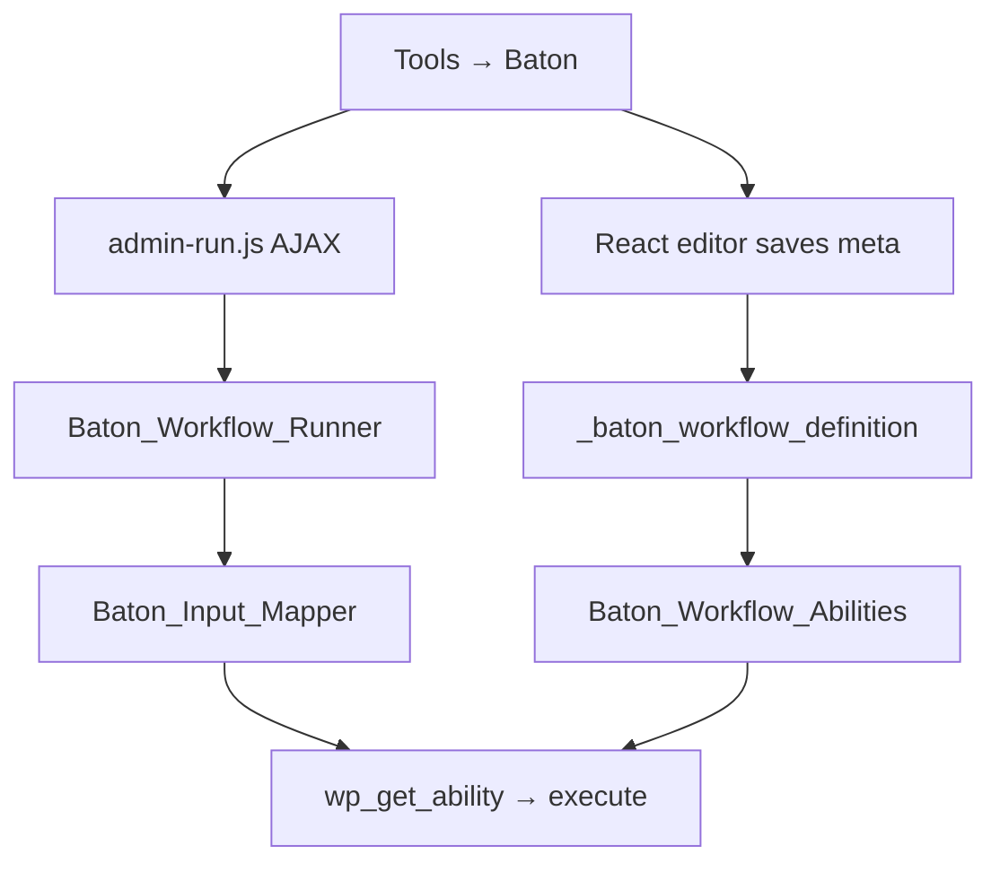

# Baton — agent guide

Baton is a WordPress plugin (v0.4.0) that chains [Abilities API](https://developer.wordpress.org/apis/abilities/) abilities into saved workflows. Admins compose workflows in **Tools → Baton**, run them from the admin, and each published workflow is also registered as its own ability (`baton/workflow-{post_id}`) for nesting and external tooling.

## Requirements

- WordPress **6.9+** (Abilities API: `wp_get_abilities`, `wp_get_ability`, `wp_register_ability`)
- PHP **7.4+**
- Node/npm only when changing the React editor (`src/`)

## What we built

### Core concepts

| Concept | Implementation |
|--------|----------------|
| Workflow storage | CPT `baton_workflow` (no public UI); definition in post meta `_baton_workflow_definition` |
| Step execution | `Baton_Workflow_Runner` — sequential steps via `WP_Ability::execute()` |
| Data between steps | **Data filters** (`input_mappings`) on connectors between ability cards; dot-path extraction via `Baton_Input_Mapper` |
| Workflow-as-ability | `Baton_Workflow_Abilities` registers `baton/workflow-{id}` under category `baton-workflows` |
| Nested workflows | Runner passes a `workflow_stack` and rejects cycles |
| Admin catalog | `Baton_Ability_Catalog` + `Baton_Schema_Paths` expose schemas, I/O summaries, and mappable paths to JS |

### Workflow definition (meta JSON)

```json
{
  "initial_input": {},
  "steps": [
    {
      "ability": "plugin/ability-slug",
      "input": {},
      "use_previous_output": false,
      "input_mappings": [
        { "source": "previous", "path": "0.plan_id", "target": "plan_id" }
      ]
    }
  ]
}
```

- **`input`**: static JSON merged into the step (edited per step in the editor).
- **`use_previous_output`**: legacy flag; runner still honors it when no mappings exist.
- **`input_mappings`**: maps from `initial` (step 1 only) or `previous` step output via dot paths into ability input fields. Scalar abilities use an empty `target` and path-only rows.
- Sanitization: `Baton_Workflow_CPT::sanitize_definition()` + `Baton_Input_Mapper::sanitize_mappings()`.

### Execution flow



Hooks: `baton_before_step`, `baton_after_step` (see `class-workflow-runner.php`).

### Admin UI

- **List** (`includes/admin/class-workflow-list-table.php`): hero banner (`assets/images/baton-banner.png`), search, `WP_List_Table` (DataViews deferred until core default).
- **Edit** (`includes/admin/class-admin.php`): title/excerpt form + hidden field `baton_workflow_definition` synced from React; abilities/definition bootstrapped as JSON in `<script type="application/json">` tags.
- **Run** (`assets/admin-run.js`): AJAX action `baton_run`, displays step-by-step report.

### Visual editor (Phase 3)

- **Stack**: `@wordpress/scripts` → `build/index.js` (commit `build/` for installs without npm).
- **Entry**: `src/index.js` mounts `WorkflowEditor` on `#baton-editor-root`.
- **UI** (`src/editor/App.js`): vertical **ability step** cards; **data filter** slots between steps (compact “Add data filter” when empty, full card when mappings exist); I/O chips open schema modals; mapping modal drafts rows until **Done**.
- **Ability picker**: native `<select>` with `<optgroup>` per ability category (`groupAbilitiesByCategory` in `utils.js`) — `@wordpress/components` `SelectControl` does not support optgroups.
- **Styles**: `assets/baton-editor.css`, list/run styles in `assets/admin.css`.

## Project layout

```
baton.php                 # Bootstrap, constants, requires
includes/
  class-plugin.php        # Singleton, abilities gate, activation
  class-workflow-cpt.php  # CPT + meta get/save/sanitize
  class-workflow-runner.php
  class-workflow-abilities.php
  class-input-mapper.php  # Dot paths, scalar vs object input
  class-schema-paths.php  # I/O summaries, path catalogs for UI
  class-ability-catalog.php
  admin/
    class-admin.php       # Menu, edit/list, enqueue, save, AJAX run
    class-workflow-list-table.php
src/
  index.js
  editor/App.js           # WorkflowEditor UI
  editor/utils.js         # Steps, mappings, grouping helpers
build/                    # Compiled editor (run npm run build after src changes)
assets/
  baton-editor.css
  admin.css
  admin-run.js
  images/baton-banner.png
```

## Development commands

```bash
cd wp-content/plugins/baton   # or clone path
npm install
npm run build                  # after any src/ change
npm start                      # watch mode while editing UI
```

PHP: no separate build step. Use strict types (`declare(strict_types=1);`) and match existing `Baton_*` class style.

## Conventions for agents

1. **Minimize scope** — Baton is a thin orchestration layer; avoid reimplementing ability logic that belongs in other plugins.
2. **Abilities API first** — Gate features on `function_exists( 'wp_get_abilities' )`; do not assume abilities from specific plugins except in docs/examples.
3. **Editor changes** — Always run `npm run build` and commit updated `build/` if the repo ships prebuilt assets.
4. **Select controls** — Use native `<select>` + `<optgroup>` for grouped ability lists; use `SelectControl` only for flat option lists (e.g. mapping source/target).
5. **Secrets** — Never commit API keys; workflow definitions may contain site-specific static input.
6. **Tests** — No automated test suite yet; manual smoke test: save workflow, run from edit screen, nest `baton/workflow-{id}` in another workflow.

## Known gaps / roadmap

- Workflow-level **initial input → step 1 data filter** in the editor (runtime supports `initial_input`; UI exposure is limited).
- CLI & Command Palette integrations for "external" workflow execution.
- ActionScheduler integration for scheduling step/workflow execution.
- Database/transient integration for persisting workflow output.
- Advanced drag-and-drop workflow building UI.
- Code snippet nodes for fully custom data processing.
- Mapping auto-suggest from schema paths.
- Replace list table with DataViews when appropriate in core.
- User-facing copy pass on mapper warning strings.

## Related docs

- [README.md](README.md) — install, usage, build instructions
- [LICENSE](LICENSE) — GPL-2.0-or-later
